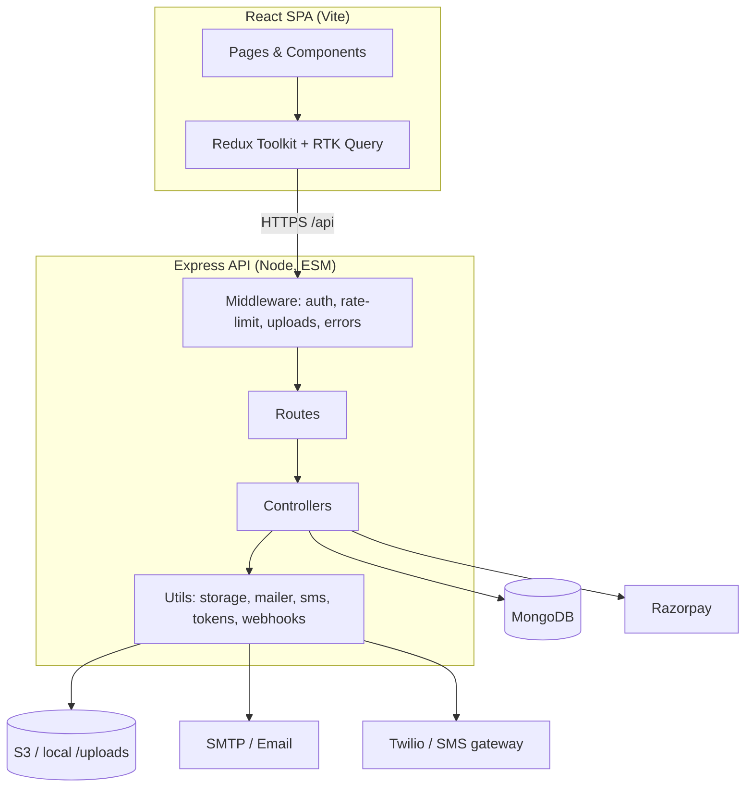
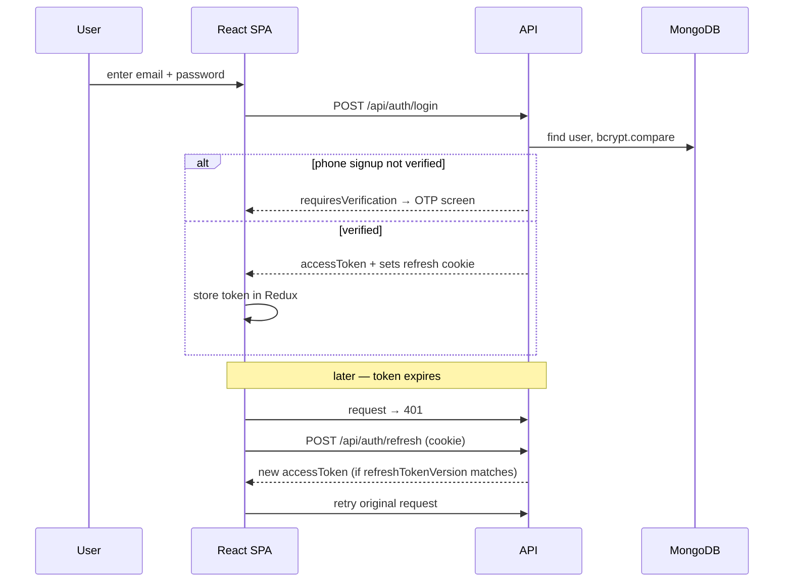
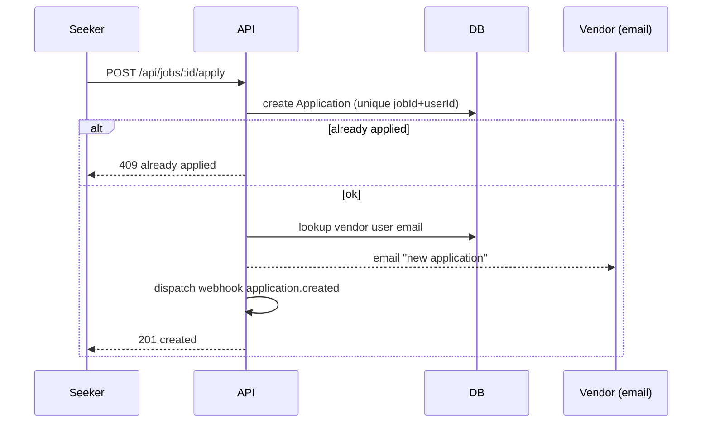
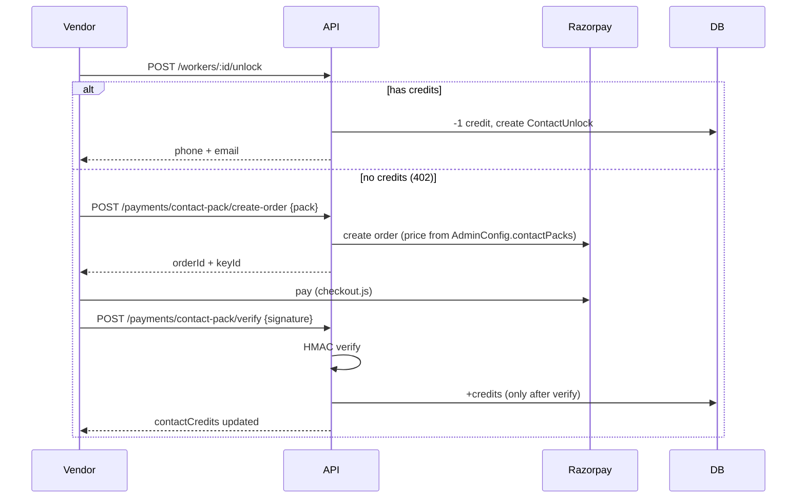
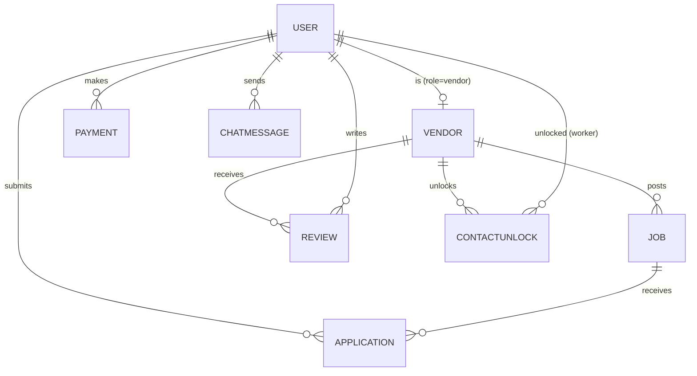
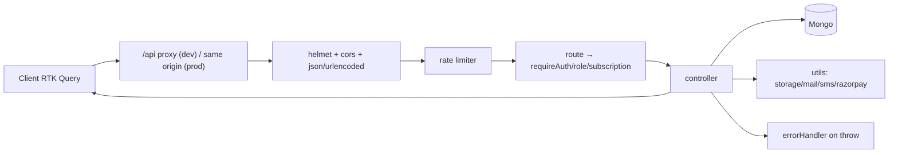

# Haryana Job Marketplace — Architecture

> Author: Engineering / Architecture
> Scope: full-stack MERN job & worker marketplace (job seekers, employers/vendors, admin)

## 1. High-level overview

A single-page React client talks to an Express REST API backed by MongoDB.
Authentication is JWT (short-lived access token + httpOnly refresh cookie).
Uploaded files go to local disk or Amazon S3 via a storage abstraction.
Payments run through Razorpay. Email/SMS are pluggable (SMTP / Twilio or a
generic HTTP gateway), all configurable at runtime from the admin panel.



## 2. Technology stack

| Layer | Tech |
|-------|------|
| Client | React 18, Vite, React Router v6, Redux Toolkit + RTK Query, Tailwind CSS, TipTap (rich text), Recharts (admin analytics), DOMPurify |
| Server | Node.js (ES modules), Express, Mongoose, JWT (`jsonwebtoken`), `bcryptjs`, `multer`, `express-rate-limit`, `helmet`, `morgan`, `node-cron` |
| Data | MongoDB (Mongoose ODM) |
| Storage | Local disk (`/uploads`) or Amazon S3 (`@aws-sdk/client-s3`) via `utils/storage.js` |
| Payments | Razorpay (orders + HMAC signature verification + webhook) |
| Messaging | Nodemailer (SMTP), Twilio or generic HTTP SMS |
| Infra/CI | GitHub Actions (build + syntax check) |

## 3. Repository layout

```
client/                 React SPA
  src/
    pages/              Route screens (public, seeker, vendor, admin/*)
    components/         Shared UI (Navbar, JobCard, RichTextEditor, …)
    store/              jobsApi.js (RTK Query), authSlice, store
    api/                axios instance (token + refresh interceptor)
    utils/              sanitizeHtml, …
server/                 Express API
  src/
    routes/             one router per domain (auth, jobs, workers, …)
    controllers/        request handlers
    models/             Mongoose schemas
    middleware/         auth, uploads (multer), error handler
    utils/              storage, mailer, sms, tokens, webhooks, subscription
    jobs/               blogScheduler (node-cron automation)
    scripts/            seed.js, etl.js, memdb.js
docs/                   architecture, features, test cases, S3 setup
```

## 4. Authentication & session flow

- **Access token**: short-lived JWT, sent as `Authorization: Bearer`. Held in
  memory on the client (Redux), never persisted.
- **Refresh token**: httpOnly cookie. `refreshTokenVersion` on the user allows
  server-side revocation (incremented on logout / password change).
- On app load the client calls `/auth/refresh` to silently restore a session.



Roles: `seeker`, `vendor`, `admin`. `requireAuth` loads the user (without the
password hash); `requireRole(...)` and `requireActiveSubscription` gate
sensitive routes. The client mirrors this with `<ProtectedRoute roles=[...]>`.

## 5. Core domain flows

### 5.1 Job application



### 5.2 Contact-unlock & paid credits (vendors)

Vendors spend **credits** to reveal a worker's phone/email. Credits are bought
through Razorpay — never granted for free.



### 5.3 Subscriptions & premium gating

`User.subscription = { plan, expiresAt }`. Purchase mirrors the contact-pack
flow (`/payments/subscribe/*`). Premium features (intro video upload) are
enforced server-side by `requireActiveSubscription`, not just hidden in the UI.

### 5.4 File upload (storage abstraction)

```mermaid
graph LR
  Req[multipart upload] --> Multer[multer disk storage]
  Multer --> PU["persistUpload(file, subdir)"]
  PU -->|S3 enabled| S3[(S3 bucket)] --> URLA[absolute URL]
  PU -->|else| Local[(/uploads)] --> URLR[/uploads/... URL]
```

S3 is configured from **Admin → Settings** (DB) or env vars; DB takes
precedence. See [S3_SETUP.md](S3_SETUP.md).

## 6. Data model (key collections)



- **User** — auth, role, `workerProfile` (seeker), `contactCredits` (vendor),
  `subscription`. Indexes on `workerProfile.skillCategory` and a 2dsphere geo
  index.
- **Vendor** — org profile, `paymentStatus`, featured flag, documents/logo/video.
- **Job** — title/description (text index), category/district (indexes), geo
  (2dsphere), `status` open/closed.
- **Application** — unique compound index `{jobId, userId}`; status workflow.
- **Payment** — `type` = vendor_signup | subscription | contactPack; Razorpay ids.
- **AdminConfig** — singleton (`_id: "config"`) holding all runtime settings
  (branding, fees, plans, integrations, S3).
- **Blog, Banner, Review, Webhook, ChatMessage, ContactUnlock, ActivityLog,
  EtlRun**.

## 7. Cross-cutting concerns

- **Rate limiting**: strict on `/api/auth` (50/15min), general on `/api` (600/15min).
- **Security headers**: `helmet`; CORS locked to `CLIENT_URL` with credentials.
- **HTML safety**: admin-authored HTML sanitized with DOMPurify on render.
- **Error handling**: central handler; generic 5xx message in production,
  duplicate-key → 409, ValidationError → 400.
- **Health**: `/health` reports DB connection state for orchestrator probes.
- **Graceful shutdown**: SIGTERM/SIGINT drain HTTP + close Mongo.
- **Background jobs**: `node-cron` blog automation (`jobs/blogScheduler.js`).
- **Webhooks**: outbound events (job/application/blog) dispatched to configured
  endpoints; Razorpay inbound webhook is the payment source of truth.

## 8. Request lifecycle



## 9. Environments & deployment

- **Dev**: Vite dev server (`:3000`) proxies `/api` and `/uploads` to the API
  (`:5000`). MongoDB local or `mongodb-memory-server` (`scripts/memdb.js`).
- **Prod**: build the client (`vite build`) and serve statically; run the API
  with a process manager; point `MONGO_URI` at a managed DB; enable S3 so
  uploads survive redeploys; set real Razorpay/SMTP/SMS credentials (env or
  admin panel).

## 10. Known gaps / roadmap

Tracked from the codebase review. High-impact items still open:

| Area | Item |
|------|------|
| Features | Resume upload; in-app notifications; saved/bookmarked jobs; real-time chat (currently 30s polling); job expiry & view counts |
| Quality | Automated test suite (see [TEST_CASES.md](TEST_CASES.md)); request validation library (joi/zod); OpenAPI docs |
| Performance | Image compression on upload; config caching |
| Security | Encrypt integration secrets at rest; sandbox admin `analyticsScript` |

See [FEATURES.md](FEATURES.md) for the full feature inventory and
[TEST_CASES.md](TEST_CASES.md) for the test plan.
